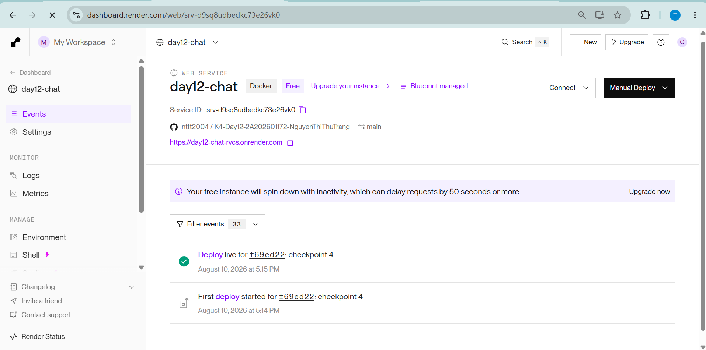
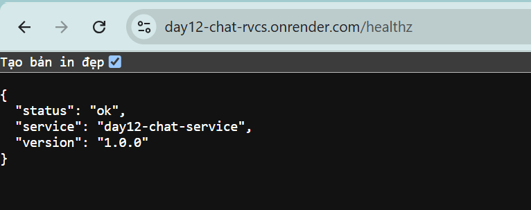

# Bằng chứng deploy

Đặt ảnh chụp màn hình bản deploy vào thư mục `screenshots/` với đúng tên sau:

## Dashboard Render

Ảnh dashboard phải thể hiện service `day12-chat` đã deploy thành công:

File cần đặt: `screenshots/dashboard.png`

## Kiểm tra healthz

Ảnh kết quả gọi Public URL `/healthz`, trong đó HTTP status là `200`:

File cần đặt: `screenshots/healthz.png`

Public URL hiện tại:

`https://day12-chat-rvcs.onrender.com/healthz`
